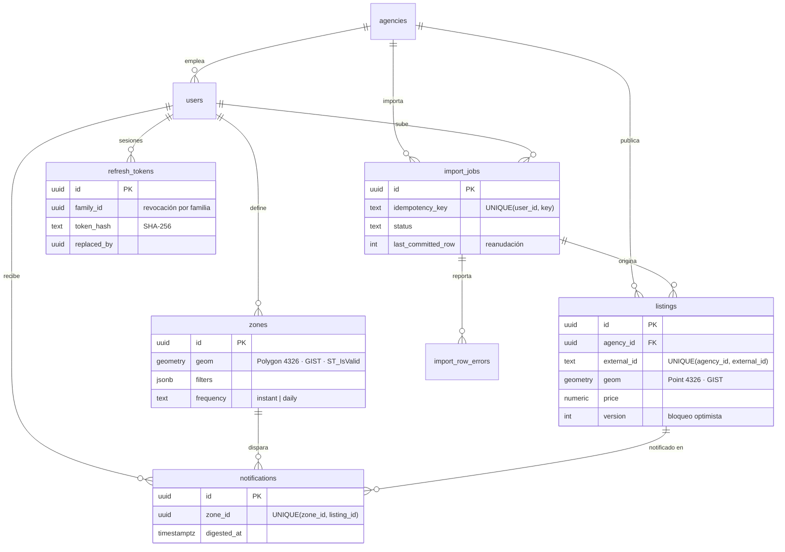

# Modelo de datos

```mermaid
erDiagram
  agencies ||--o{ users : "emplea"
  agencies ||--o{ listings : "publica"
  agencies ||--o{ import_jobs : "importa"
  users ||--o{ refresh_tokens : "sesiones"
  users ||--o{ import_jobs : "sube"
  users ||--o{ zones : "define"
  users ||--o{ notifications : "recibe"
  import_jobs ||--o{ import_row_errors : "reporta"
  import_jobs ||--o{ listings : "origina"
  zones ||--o{ notifications : "dispara"
  listings ||--o{ notifications : "notificado en"

  listings {
    uuid id PK
    uuid agency_id FK
    text external_id "UNIQUE(agency_id, external_id)"
    geometry geom "Point 4326 · GIST"
    numeric price
    int version "bloqueo optimista"
  }
  import_jobs {
    uuid id PK
    text idempotency_key "UNIQUE(user_id, key)"
    text status
    int last_committed_row "reanudación"
  }
  refresh_tokens {
    uuid id PK
    uuid family_id "revocación por familia"
    text token_hash "SHA-256"
    uuid replaced_by
  }
  zones {
    uuid id PK
    geometry geom "Polygon 4326 · GIST · ST_IsValid"
    jsonb filters
    text frequency "instant | daily"
  }
  notifications {
    uuid id PK
    uuid zone_id "UNIQUE(zone_id, listing_id)"
    timestamptz digested_at
  }
```
